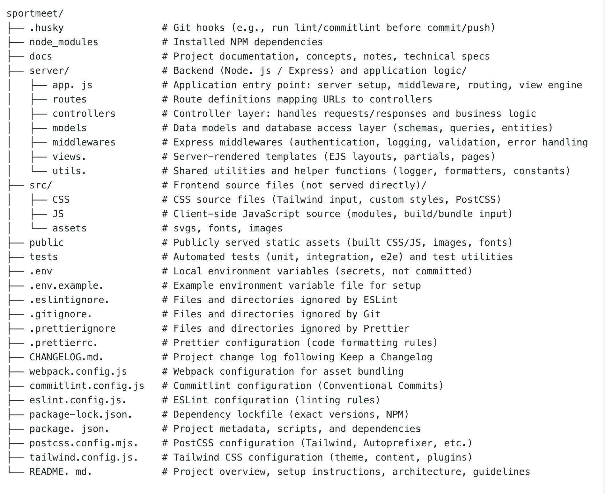

# Sportmeet

A modern web platform for managing and organizing sports events, built with Node.js, Express
and Tailwind CSS.

---

## 📑 Table of Contents

1. [Project Overview](#project-overview)
2. [Project Folder Structure](#project-folder-structure)

---

## Project Overview

The **Sporttermin Plattform** is designed to provide a clean and scalable architecture
for a sports scheduling platform.  
It follows a clear separation of concerns between backend, frontend sources, public assets
and configuration.

The project is structured to be:

- **Maintainable**
- **Scalable**
- **Team-friendly**
- **Production-ready**

---

## Project Folder Structure

The following diagram shows the high-level folder and file structure of the project and explains the responsibility of each part.

> This structure is intended as a shared reference for all developers working on the project.

### Folder Structure Overview

