# Qualitätsnachweise

## Inhaltsangabe

- [Performance](#performance)
- [Risiken und Gegenmaßnahmen](#risiken-und-gegenmaßnahmen)
- [Datensicherheit und Datenschutz](#datensicherheit-und-datenschutz)
- [Responsive Design und Browser-Kompatibilität](#responsive-design-und-browser-kompatibilität)
- [Benutzerfreundlichkeit](#benutzerfreundlichkeit)
- [Barrierefreiheit](#barrierefreiheit)
- [Zuverlässigkeit der Termin-Erinnerungen](#zuverlässigkeit-der-termin-erinnerungen)
- [Datenschnittstellen und Testnachweis](#datenschnittstellen-und-testnachweis)
- [Erweiterbarkeit](#erweiterbarkeit)

## Performance

Zur Überprüfung der Performance wurden mehrere Lasttests mit jeweils `100` gleichzeitigen Anfragen durchgeführt. Jeder Test lief `30 Sekunden` lang und wurde lokal mit `autocannon` gegen zentrale Routen der Anwendung ausgeführt. Getestet wurden die öffentliche Startseite `/`, die geschützte Termin-Detailseite `/events/4`, das Nutzer-Dashboard `/me` sowie die Gruppenseite `/groups/2`.

Verwendete Befehle:

```bash
npx autocannon -c 100 -d 30 http://localhost:3000/
npx autocannon -c 100 -d 30 -H "Cookie: sportmeet_sid=DEIN_COOKIE_WERT" http://localhost:3000/events/4
npx autocannon -c 100 -d 30 -H "Cookie: sportmeet_sid=DEIN_COOKIE_WERT" http://localhost:3000/me
npx autocannon -c 100 -d 30 -H "Cookie: sportmeet_sid=DEIN_COOKIE_WERT" http://localhost:3000/groups/2
```

### Ergebnis

| Endpunkt    | Nutzer | Dauer | Durchschnittliche Latenz | 99%-Latenz | Requests/Sekunde | Fehler | Timeouts |
| ----------- | -----: | ----: | -----------------------: | ---------: | ---------------: | -----: | -------: |
| `/`         |    100 |  30 s |                 43.72 ms |      58 ms |          2260.87 |      0 |        0 |
| `/events/4` |    100 |  30 s |                 87.01 ms |     115 ms |          1140.37 |      0 |        0 |
| `/me`       |    100 |  30 s |                 167.5 ms |     190 ms |           593.04 |      0 |        0 |
| `/groups/2` |    100 |  30 s |                 67.39 ms |      81 ms |          1471.24 |      0 |        0 |

Bewertung:

Die Anwendung blieb während der Tests stabil und erreichbar. Die Startseite erreichte bei `100` gleichzeitigen Anfragen eine durchschnittliche Antwortzeit von `43.72 ms` und eine `99%-Latenz` von `58 ms`. Die geschützte Termin-Detailseite `/events/4` zeigte unter derselben Last ein stabiles Verhalten mit einer durchschnittlichen Antwortzeit von `87.01 ms` und einer `99%-Latenz` von `115 ms`. Das eingeloggte Nutzer-Dashboard `/me` blieb ebenfalls stabil und erreichte eine durchschnittliche Antwortzeit von `167.5 ms` bei einer `99%-Latenz` von `190 ms`. Auch die Gruppenseite `/groups/2` blieb unter Last stabil und erreichte eine durchschnittliche Antwortzeit von `67.39 ms` bei einer `99%-Latenz` von `81 ms`. Während aller Tests traten keine Fehler und keine Timeouts auf.

## Risiken und Gegenmaßnahmen

Ein technisches Risiko besteht in der Abhängigkeit von externen Diensten. Die Anwendung nutzt **Brevo** für den Versand von E-Mails sowie **Nominatim** auf Basis von **OpenStreetMap** für Geocoding-Funktionen. Falls einer dieser Dienste vorübergehend nicht verfügbar ist, können Teilfunktionen wie Erinnerungs-E-Mails oder die Adressauflösung eingeschränkt sein.

Die Kernfunktionen der Anwendung bleiben davon jedoch weitgehend unberührt. Zur Risikominimierung werden externe Aufrufe kontrolliert eingebunden und Fehlerfälle abgefangen, sodass die Anwendung auch bei Ausfall einzelner externer Dienste stabil weiterlaufen kann. Zudem wurde die Nutzung dieser Dienste transparent in der Datenschutzerklärung dokumentiert.

## Datensicherheit und Datenschutz

Die Anwendung verarbeitet personenbezogene Daten nach dem Prinzip der Datenminimierung. Für die Nutzung der Plattform werden nur die technisch erforderlichen Informationen gespeichert, insbesondere Vorname, Nachname, E-Mail-Adresse und ein Passwort-Hash.

Passwörter werden nicht im Klartext gespeichert, sondern gehasht in der Datenbank abgelegt. Dadurch wird das Risiko reduziert, dass Zugangsdaten bei einem unbefugten Datenzugriff direkt ausgelesen werden können.

<figure>

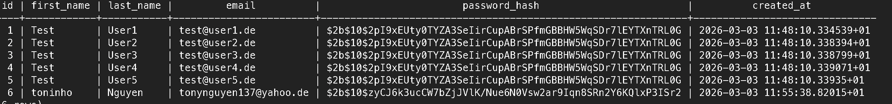

<figcaption>Abbildung: Beispielhafter Datenbankeintrag mit gehasht gespeichertem Passwort anstelle eines Klartext-Passworts.</figcaption>
</figure>

Im Bereich Datenschutz wurde die Anwendung so dokumentiert, dass die tatsächliche technische Umsetzung nachvollziehbar bleibt. Externe Dienste werden nur eingesetzt, wenn sie für den Betrieb notwendig sind. Dazu gehören **Brevo** für den Versand von E-Mails sowie **Nominatim** auf Basis von **OpenStreetMap** für Geocoding-Funktionen. Diese Nutzung ist in der Datenschutzerklärung transparent beschrieben.

Für die Anzeige öffentlicher Termine im Umkreis von `10 km` wird zusätzlich die **Geolocation-Funktion des Browsers** verwendet. Die Standortabfrage erfolgt nur nach **ausdrücklicher Zustimmung des Nutzers** und dient **ausschließlich** dazu, öffentliche Termine in der näheren Umgebung zu ermitteln.

Zusätzlich wurde die Funktion zur Kontolöschung umgesetzt. Nutzer können ihr Konto löschen, wobei personenbezogene Daten aus dem System entfernt werden, soweit sie nicht mehr für technische Konsistenz innerhalb der Anwendung benötigt werden.

Bewertung:

Die Anforderungen an Datensicherheit und Datenschutz sind für den Projektumfang erfüllt. Besonders relevant sind dabei die gehashte Speicherung von Passwörtern, die transparente Dokumentation externer Dienste sowie die Möglichkeit zur Kontolöschung.

## Responsive Design und Browser-Kompatibilität

Zur Überprüfung der responsiven Darstellung wurde die Anwendung in verschiedenen Bildschirmgrößen getestet. Dabei wurde geprüft, ob Navigation, Inhalte, Formulare und Kartenbereiche sowohl auf großen als auch auf kleineren Geräten nutzbar bleiben.

<figure>

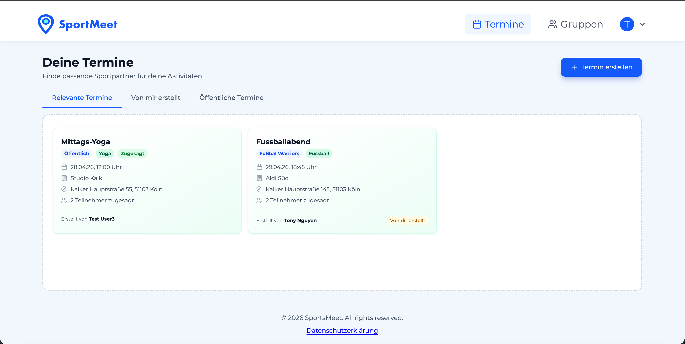

<figcaption>Abbildung: Dashboard in der Desktop-Ansicht.</figcaption>
</figure>

<figure>

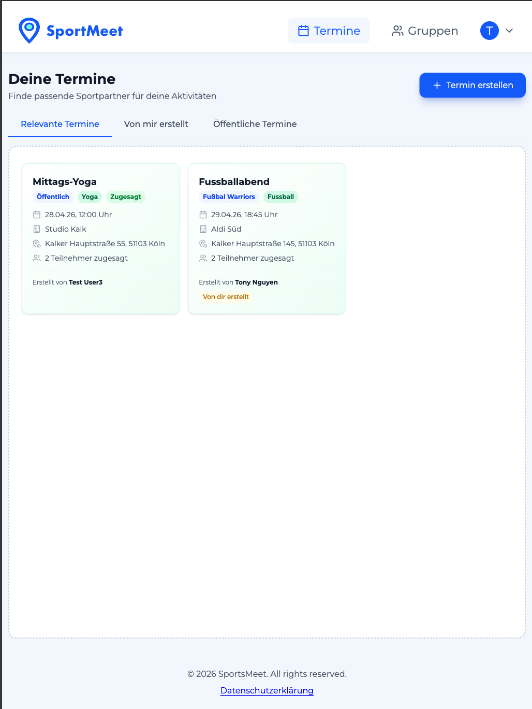

<figcaption>Abbildung: Dashboard in der Tablet-Ansicht.</figcaption>
</figure>

<figure>

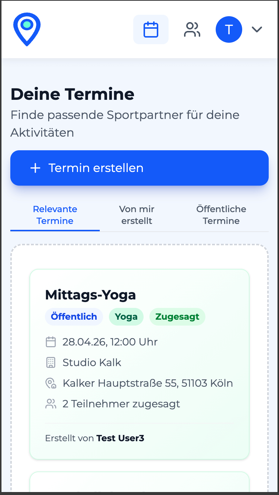

<figcaption>Abbildung: Dashboard in der Mobile-Ansicht.</figcaption>
</figure>

<figure>

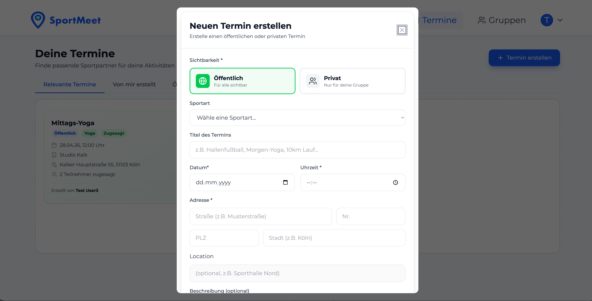

<figcaption>Abbildung: Event-Formular in der Desktop-Ansicht.</figcaption>
</figure>

<figure>

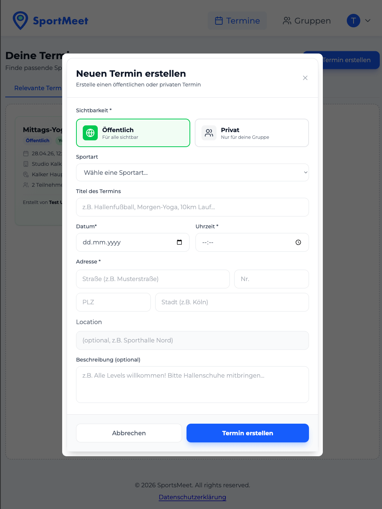

<figcaption>Abbildung: Event-Formular in der Tablet-Ansicht.</figcaption>
</figure>

<figure>

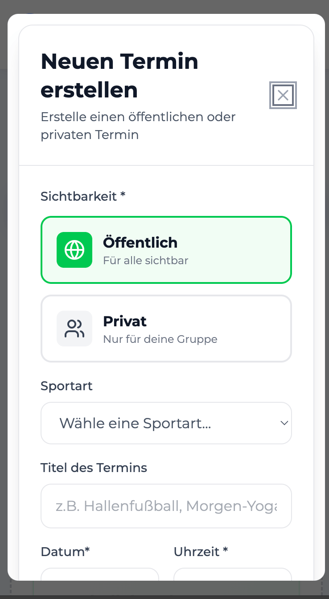

<figcaption>Abbildung: Event-Formular in der Mobile-Ansicht.</figcaption>
</figure>

Hinweis: In der **Mobile-Ansicht** ist das Event-Formular aufgrund der geringeren Höhe des Viewports **nicht vollständig gleichzeitig sichtbar**. Die Inhalte bleiben jedoch über die **Scroll-Funktion innerhalb des Dialogs** erreichbar und nutzbar.

### Getestete Kombinationen

| Gerät / Ansicht | Browser | Ergebnis                       |
| --------------- | ------- | ------------------------------ |
| Desktop         | Chrome  | Layout korrekt dargestellt     |
| Desktop         | Firefox | Layout korrekt dargestellt     |
| Desktop         | Safari  | Layout korrekt dargestellt     |
| Desktop         | Opera   | Layout korrekt dargestellt     |
| Desktop         | Edge    | Layout korrekt dargestellt     |
| Tablet          | Chrome  | Responsive Darstellung korrekt |
| Tablet          | Firefox | Responsive Darstellung korrekt |
| Tablet          | Safari  | Responsive Darstellung korrekt |
| Tablet          | Opera   | Responsive Darstellung korrekt |
| Tablet          | Edge    | Responsive Darstellung korrekt |
| Mobile          | Chrome  | Responsive Darstellung korrekt |
| Mobile          | Firefox | Responsive Darstellung korrekt |
| Mobile          | Safari  | Responsive Darstellung korrekt |
| Mobile          | Opera   | Responsive Darstellung korrekt |
| Mobile          | Edge    | Responsive Darstellung korrekt |

Bewertung:

Die Anwendung wurde erfolgreich in den Browsern `Chrome`, `Firefox`, `Safari`, `Opera` und `Edge` getestet. Zusätzlich zeigen die Screenshots, dass sowohl das Dashboard als auch das Event-Formular auf `Desktop`, `Tablet` und `Mobile` responsiv nutzbar bleiben. In der mobilen Dialogansicht werden nicht immer alle Inhalte gleichzeitig dargestellt, sie bleiben jedoch über die Scroll-Funktion innerhalb des Dialogs erreichbar. Damit ist die Anforderung an Responsive Design und Browser-Kompatibilität für den Projektumfang erfüllt.

## Benutzerfreundlichkeit

Die Benutzerfreundlichkeit wurde anhand typischer Kernfunktionen der Anwendung bewertet. Dazu gehören insbesondere die Anmeldung, das Erstellen von Terminen, der Gruppenbeitritt, die Teilnahmeverwaltung und die Kommentar-Funktion. Dabei wurde geprüft, ob wichtige Aktionen schnell auffindbar sind und ob das System bei unvollständigen oder fehlerhaften Eingaben klare Rückmeldungen gibt.

<figure>

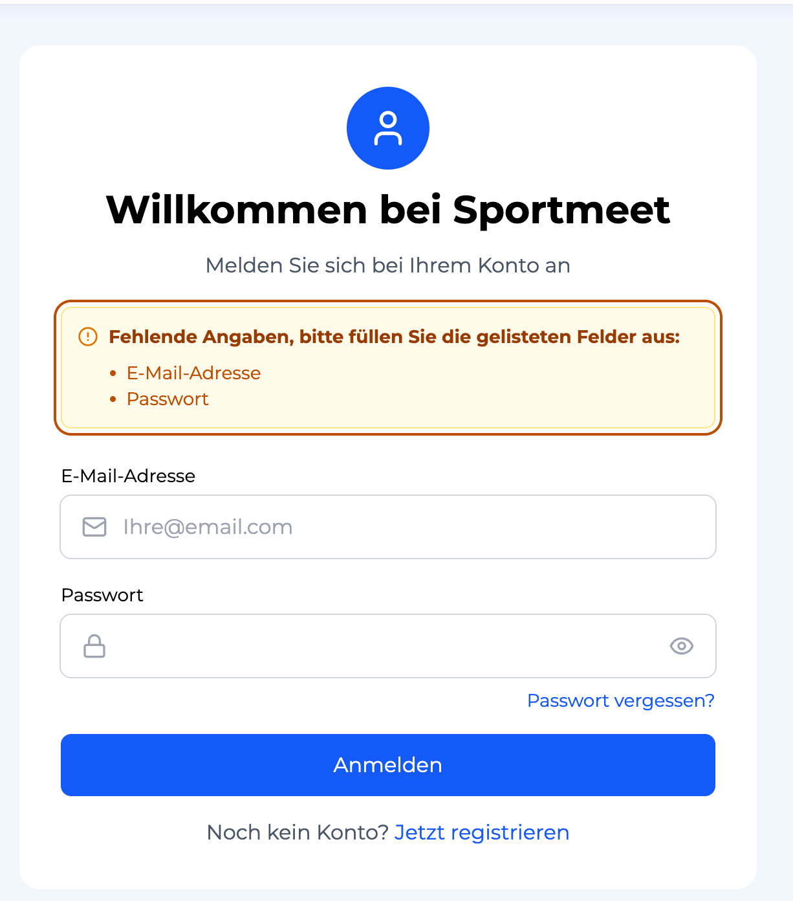

<figcaption>Abbildung: Formularrückmeldung bei unvollständigen Eingaben im Login-Bereich.</figcaption>
</figure>

<figure>

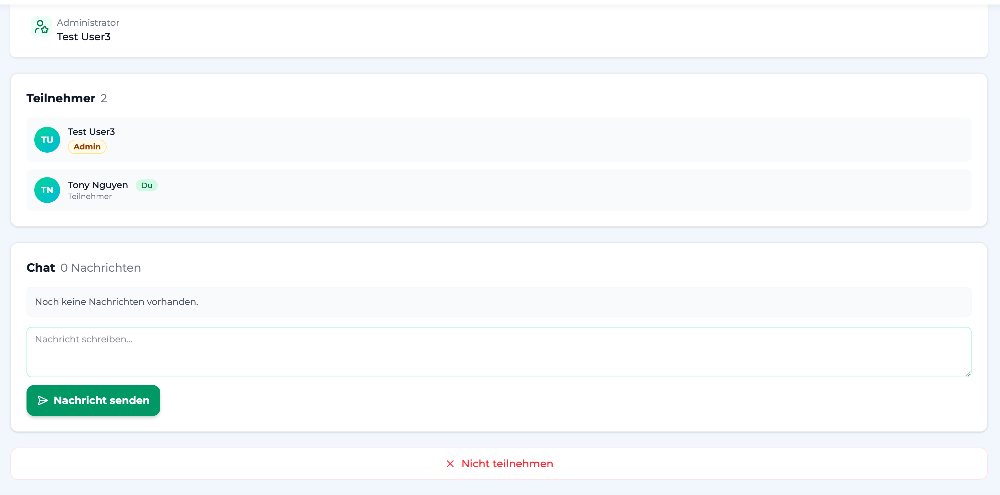

<figcaption>Abbildung: Icons zur Unterstützung von Aktionen in der Event-Detailansicht.</figcaption>
</figure>

<figure>

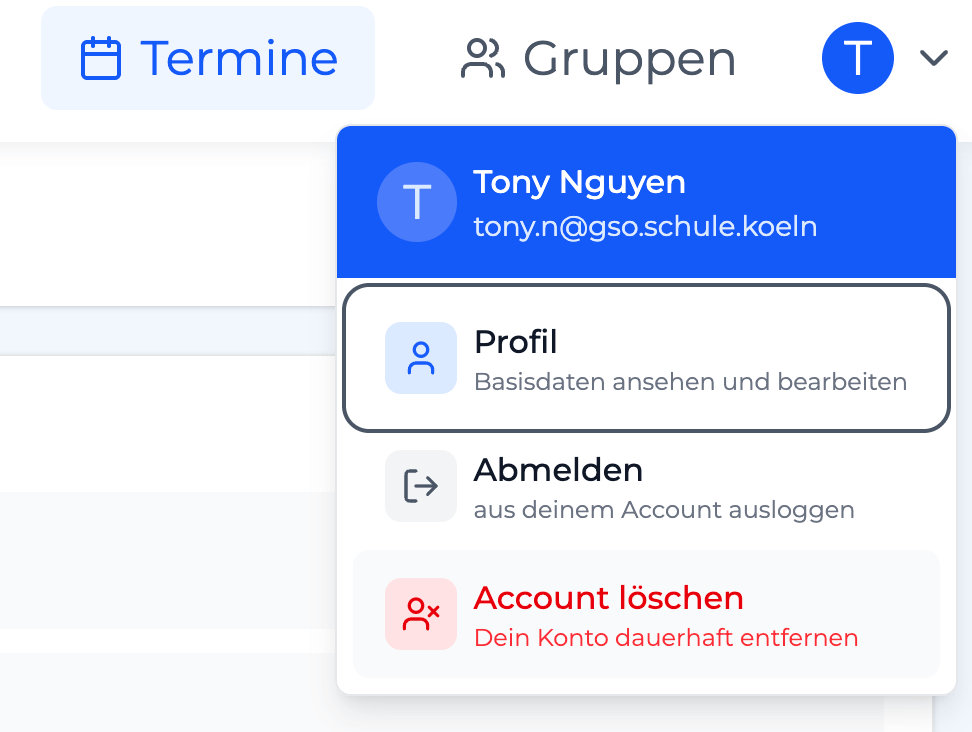

<figcaption>Abbildung: Icons im Dropdown-Menü zur schnelleren Orientierung.</figcaption>
</figure>

<figure>

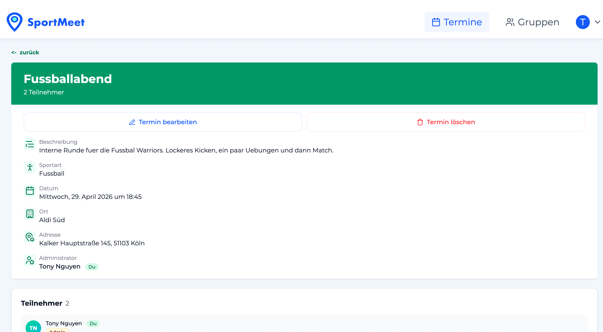

<figcaption>Abbildung: Wichtige Aktionen auf der Termin-Detailseite direkt im oberen Bereich.</figcaption>
</figure>

<figure>


<figcaption>Abbildung: Farblich hervorgehobener Button für die Hauptfunktion Termin erstellen.</figcaption>
</figure>

<figure>

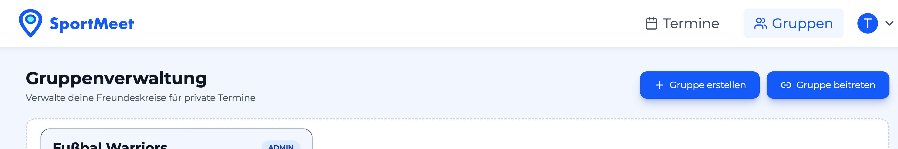

<figcaption>Abbildung: Farblich hervorgehobener Button für die Hauptfunktion Gruppe erstellen & Gruppe beitreten.</figcaption>
</figure>

Die Anwendung unterstützt die Nutzerführung durch sichtbare Formularhinweise und Rückmeldungen bei fehlenden Angaben. Dadurch können Eingabefehler schneller erkannt und direkt korrigiert werden. Zusätzlich sind die zentralen Funktionen über wenige Schritte erreichbar und in klar getrennten Bereichen organisiert.

Zur besseren Orientierung werden außerdem gezielt **Icons** verwendet. Diese unterstützen die schnelle Erkennbarkeit wichtiger Aktionen, beispielsweise bei Teilnahmefunktionen, Nachrichtenbereichen und Navigationspunkten im Dropdown-Menü. Dadurch wird die Oberfläche visuell klarer und für Nutzer schneller erfassbar.

Wichtige Hauptfunktionen wurden zudem bewusst **groß** und **farblich gefüllt** gestaltet. Sie heben sich als visuelle Orientierungspunkte vom sonst eher hellen Design ab und dienen als bewusste **Eyecatcher**. Dadurch können Nutzer zentrale Aktionen wie Termine, Gruppen oder Teilnahmefunktionen schneller erkennen und direkt aufrufen.

### Geprüfte Aufgaben

| Aufgabe             | Ergebnis    | Beobachtung                                         |
| ------------------- | ----------- | --------------------------------------------------- |
| Anmeldung           | Erfolgreich | Formular zeigt Rückmeldung bei fehlenden Angaben    |
| Termin erstellen    | Erfolgreich | Dialog ist klar strukturiert und nachvollziehbar    |
| Gruppe beitreten    | Erfolgreich | Einladungsfunktion ist direkt erreichbar            |
| Teilnahme ändern    | Erfolgreich | Aktionen zum Zu- und Absagen sind eindeutig benannt |
| Kommentar schreiben | Erfolgreich | Eingabefeld und Absenden sind direkt verständlich   |

Bewertung:

Die Benutzeroberfläche ist für die wichtigsten Anwendungsfälle klar strukturiert und verständlich aufgebaut. Besonders die Formularrückmeldungen, die Platzierung wichtiger Aktionen im sichtbaren Bereich sowie der gezielte Einsatz von **Icons** und farblich hervorgehobenen Hauptbuttons unterstützen eine fehlerarme und schnell erfassbare Nutzung. Damit ist die Anforderung an Benutzerfreundlichkeit für den Projektumfang erfüllt.

## Barrierefreiheit

Im Pflichtenheft ist für die Barrierefreiheit ein **Grundniveau** gefordert. Genannt werden dabei insbesondere **kontrastreicher Text**, ein **responsives Layout** sowie **klare Schriftgrößen**, ohne dass eine vollständige WCAG-Abdeckung verlangt wird.

Zur Überprüfung wurden die Kernseiten **`/me`**, **`/groups/:id`** und **`/events/:id`** mit **Google Lighthouse** getestet. Dabei wurde sowohl auf **Desktop** als auch auf **Mobile** jeweils ein Ergebnis von **100 %** im Bereich Accessibility erreicht.

### Lighthouse-Ergebnisse

| Seite         | Desktop | Mobile |
| ------------- | ------: | -----: |
| `/me`         |   100 % |  100 % |
| `/groups/:id` |   100 % |  100 % |
| `/events/:id` |   100 % |  100 % |

<figure>


<figcaption>Abbildung: Beispielhafter Lighthouse-Nachweis im Bereich Accessibility.</figcaption>
</figure>

Die Lighthouse-Nachweise für **`/me`**, **`/groups/:id`** und **`/events/:id`** bestätigen, dass die grundlegenden Anforderungen aus dem Pflichtenheft im Projektumfang erfüllt sind. Dazu gehören eine gut lesbare und kontrastreiche Darstellung, die responsive Nutzbarkeit auf verschiedenen Bildschirmgrößen sowie eine insgesamt klare und strukturierte Oberfläche.

Bewertung:

Die geforderte **Barrierefreiheit auf Grundniveau** ist damit für die getesteten Kernseiten **`/me`**, **`/groups/:id`** und **`/events/:id`** nachgewiesen. Die im Pflichtenheft genannten Punkte zu kontrastreichem Text, responsivem Layout und klaren Schriftgrößen sind damit für Desktop und Mobile erfüllt.

## Zuverlässigkeit der Termin-Erinnerungen

Im Pflichtenheft ist festgelegt, dass das System automatisch eine Erinnerungs-E-Mail an alle zugesagten Teilnehmer und den Ersteller versendet. Die E-Mail muss Terminname, Datum, Uhrzeit, Ort und Teilnehmerliste enthalten. Zusätzlich soll der Versandstatus gespeichert werden und Fehler müssen erkennbar sein.

Zur Überprüfung wurde ein kontrollierter Test mit verkürztem Erinnerungsintervall durchgeführt. Dabei wurde temporär ein kleines Zeitfenster für den Reminder-Prozess konfiguriert, damit der Versand innerhalb weniger Minuten testbar ist. Anschließend wurde ein Testtermin erstellt, an dem sowohl `Test User1` als auch `Tony Nguyen` beteiligt waren.

<figure>

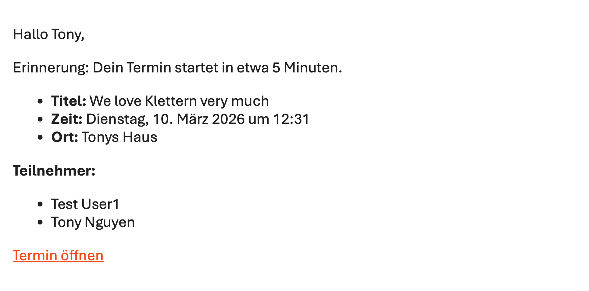

<figcaption>Abbildung: Erfolgreich versendete Erinnerungs-E-Mail mit Terminname, Zeit, Ort und Teilnehmerliste.</figcaption>
</figure>

<figure>


<figcaption>Abbildung: Datenbankansicht der Nutzer, anhand derer die Nutzer-IDs nachvollzogen werden können.</figcaption>
</figure>

<figure>

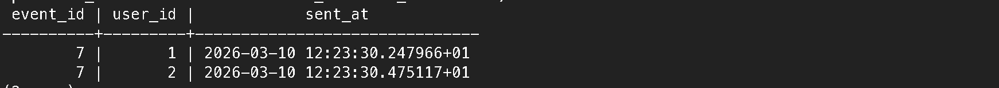

<figcaption>Abbildung: Datenbankeinträge des Reminder-Versands mit `user_id`, `event_id` und `sent_at`.</figcaption>
</figure>

Die empfangene E-Mail zeigt, dass die Erinnerungsfunktion korrekt arbeitet. Der Versand erfolgte automatisiert, enthielt den Termin **"We love Klettern very much"**, den geplanten Zeitpunkt, den Ort **"Tonys Haus"** sowie die Teilnehmerliste mit **Test User1** und **Tony Nguyen**. Damit sind die im Pflichtenheft geforderten Inhaltsbestandteile nachgewiesen.

Zusätzlich zeigt der Datenbanknachweis, dass der Reminder-Versand auch technisch gespeichert wird. Über die Nutzeransicht lassen sich die beteiligten Nutzer-IDs nachvollziehen, während in der Tabelle für Reminder-Zustellungen `user_id`, `event_id` und `sent_at` gespeichert werden. Damit ist auch der im Pflichtenheft genannte Versandstatus nachvollziehbar dokumentiert.

Ein Doppelversand wird dadurch vermieden, dass jede erfolgreich versendete Erinnerung pro Kombination aus `event_id` und `user_id` in der Tabelle für Reminder-Zustellungen gespeichert wird. Dadurch kann dieselbe Erinnerung für denselben Nutzer nicht erneut als offener Versandfall behandelt werden.

Fehlerfälle werden zusätzlich über den Reminder-Prozess protokolliert. Dadurch bleibt nachvollziehbar, ob ein Versand erfolgreich war, keine Empfänger gefunden wurden oder ein Fehler beim Versand aufgetreten ist.

Bewertung:

Die Zuverlässigkeit der Termin-Erinnerungen ist für den Projektumfang nachgewiesen. Der automatische Versand funktioniert, die E-Mail enthält die geforderten Informationen und der Test zeigt, dass der Reminder-Prozess im vorgesehenen Zeitfenster korrekt ausgelöst wird.

## Datenschnittstellen und Testnachweis

Die im Pflichtenheft beschriebenen REST-/JSON-Schnittstellen wurden in der Anwendung umgesetzt und zusätzlich automatisiert getestet. Dabei wurde nicht nur geprüft, ob die Routen korrekt verdrahtet sind, sondern auch, ob zentrale Endpunkte das erwartete Verhalten und die vorgesehenen JSON-Antworten liefern.

### Geprüfte REST-/JSON-Endpunkte

| Endpunkt                       | Funktion                            | Nachweis                        |
| ------------------------------ | ----------------------------------- | ------------------------------- |
| `GET /events`                  | Sichtbare Termine laden             | automatisierter Controller-Test |
| `GET /events/:id/participants` | Teilnehmerliste eines Termins laden | automatisierter Controller-Test |
| `GET /events/:id/comments`     | Kommentare eines Termins laden      | automatisierter Controller-Test |
| `DELETE /events/:id`           | Termin löschen                      | automatisierter Controller-Test |
| `GET /groups/:id/members`      | Gruppenmitglieder laden             | automatisierter Controller-Test |

Zusätzlich wurden die Routen auch auf Router-Ebene geprüft, sodass nachvollziehbar ist, dass Requests an die richtigen Handler weitergegeben werden. Dadurch ist der Nachweis für die im Pflichtenheft aufgeführten Datenschnittstellen sowohl auf Routing- als auch auf Verhaltensebene erbracht.

## Erweiterbarkeit

Die Anwendung ist so strukturiert, dass neue Funktionen möglichst gezielt in einem Teilbereich ergänzt werden können, ohne das gesamte System umzubauen. Dazu ist der Code in klar getrennte Bereiche wie `routes`, `controller`, `model`, `service` und `view` gegliedert und orientiert sich damit an einer klar getrennten **MVC-Struktur**.

Diese Struktur unterstützt die Erweiterbarkeit, weil Routing, Geschäftslogik, Datenzugriff und Benutzeroberfläche voneinander getrennt bleiben. Neue Funktionen wie zusätzliche Filter, weitere Terminarten, neue Benachrichtigungen oder weitere Oberflächenansichten können dadurch in der Regel modular ergänzt werden.

Auch das Frontend-JavaScript ist modular und objektorientiert aufgebaut. Interaktive Elemente wie Tabs, Dropdowns oder Formularverhalten sind in getrennten JavaScript-Modulen organisiert und dadurch ebenfalls leichter erweiterbar.

Bereits im Projekt umgesetzte Erweiterungen wie die Profilverwaltung, die Erinnerungsfunktion, zusätzliche Tabs auf der Terminseite sowie neue API-Aliasrouten zeigen, dass neue Anforderungen in die bestehende Struktur integriert werden konnten, ohne die Grundarchitektur zu verändern.

Bewertung:

Die Anforderung an Erweiterbarkeit ist für den Projektumfang erfüllt. Die modulare Struktur der Anwendung schafft eine gute Grundlage dafür, spätere Funktionen mit möglichst geringem Eingriff in bestehende Bereiche zu ergänzen.
